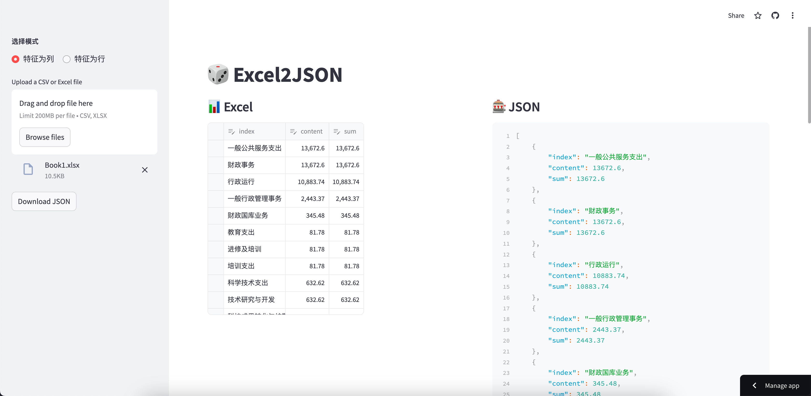

# Excel2JSON
This tool can help you to convert the format from excel to json, excel features can be located in the col or row



## Quick Start
There is a website can be used directly to demo.
>https://Excel2JSON.streamlit.app/

## Get Started
To get started with Excel2JSON, clone the repository and follow these simple steps:

0. **Change your path at first, which the folder is located in**
```Shell
cd Excel2JSON
```

1. **Create a Virtual Environment**: I am using Python 3.9.16 currently
```shell
conda create -n <your_environment_name> python==3.9.16 -y
conda activate <your_environment_name>
```

2. **Install Requirements**
```shell
pip install -r requirements.txt
```

3. **Enter commands in terminal**
```shell
streamlit run app/app.py
```
